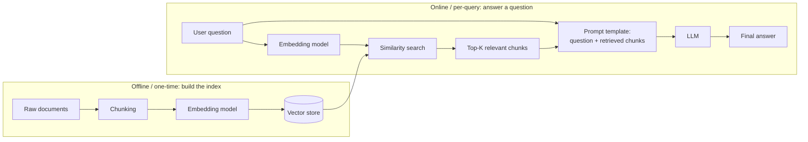

# Understanding RAG (Retrieval-Augmented Generation)

This is a conceptual write-up, not a new implementation - the note on the assignment
says RAG implementation itself is covered in a future week. What we've already built
in `src/vectorSearchDemo.ts` is the **retrieval half** of RAG; this document explains
how that connects to the missing **generation half** to form the full pipeline.

## The problem RAG solves

An LLM only knows what was in its training data, plus whatever you put directly in
the prompt. It can't answer questions about your private documents, your company's
internal docs, or anything that changed after its training cutoff - unless you feed
that information into the prompt yourself. RAG is the pattern for doing that
automatically: instead of hand-picking what to paste into the prompt, you search a
document collection for whatever is *relevant to this specific question* and paste
just that in.

## The pipeline, end to end



## The components

**1. Documents** — whatever knowledge you want the model to be able to draw on:
support articles, PDFs, internal wiki pages, code docs. In `vectorSearchDemo.ts`
this is `config.VECTOR_SEARCH_DOCUMENTS`, ten short support-KB snippets.

**2. Chunking** — long documents get split into smaller pieces (a paragraph, a few
sentences) before embedding. Two reasons: embedding models have an input size limit,
and a whole 20-page document embedded as one vector loses the specific detail you
were searching for - a smaller chunk's vector represents its meaning more precisely.
Our demo skips this step because each "document" is already one short, self-contained
sentence, but a real KB or PDF pipeline would chunk each source document first.

**3. Embedding model** — converts text into a vector (a list of numbers) that
captures its meaning, such that texts with similar meaning end up as vectors that are
close together in that space. Critically, the **same** embedding model must be used
for both the documents (at index time) and the query (at search time) - they only
end up in comparable space if generated the same way. `vectorSearchDemo.ts` uses
`nomic-embed-text` via Ollama for exactly this reason, consistently, on both sides.

**4. Vector store** — a database built to store these vectors and answer "which
stored vectors are closest to this query vector" efficiently, instead of comparing
against every single vector one by one as the collection grows into the millions.
`vectorSearchDemo.ts` uses Chroma (running via Docker) for this.

**5. Similarity search (retrieval)** — at query time, the question itself gets
embedded with the same model, then the vector store returns the top-K closest
document vectors. This is the step `vectorSearchDemo.ts` demonstrates end to end -
notice the queries there ("How do I get my money back?") don't share exact words
with the matching document ("Refunds are issued...") - that's the embedding
capturing meaning, not a keyword match.

**6. Augmented prompt** — this is the step our demo stops before, and where "RAG"
actually starts living up to its name. The retrieved chunks get inserted into a
prompt template alongside the original question, roughly:

```
Answer the question using ONLY the context below. If the context doesn't
contain the answer, say you don't know.

Context:
{top-K retrieved chunks, concatenated}

Question:
{original user question}
```

**7. LLM (generation)** — the augmented prompt is sent to a chat model exactly like
every other exercise in this project - `chat.invoke(messages)`. The model now has
the relevant facts in its context window, so it can answer using information it was
never trained on, instead of guessing or refusing.

**8. Final answer** — returned to the user, ideally grounded in the retrieved
context rather than the model's own (possibly outdated or fabricated) knowledge.

## Why this matters over just pasting everything into the prompt

You could, in theory, paste your entire document collection into every prompt. RAG
exists because that doesn't scale: context windows are finite and expensive per
token, most of a large document collection is irrelevant to any one question, and
irrelevant context can actually make answers worse, not just slower. Retrieval is
the filter that keeps only what's likely relevant, so the LLM sees a small, focused,
on-topic context instead of everything you know.

## What's still missing (deferred to a future week, per the assignment)

- Turning `vectorSearchDemo.ts`'s retrieved chunks into an actual augmented prompt
  and calling an LLM with it (steps 6-8 above).
- Chunking strategy for real multi-paragraph documents (fixed-size vs
  semantic/sentence-aware chunking, overlap between chunks).
- Re-ranking retrieved results with a separate model before generation, for cases
  where the embedding model's top-K isn't precise enough on its own.
- Evaluating RAG quality (did the answer actually use the retrieved context
  correctly, and was the right context retrieved in the first place).
